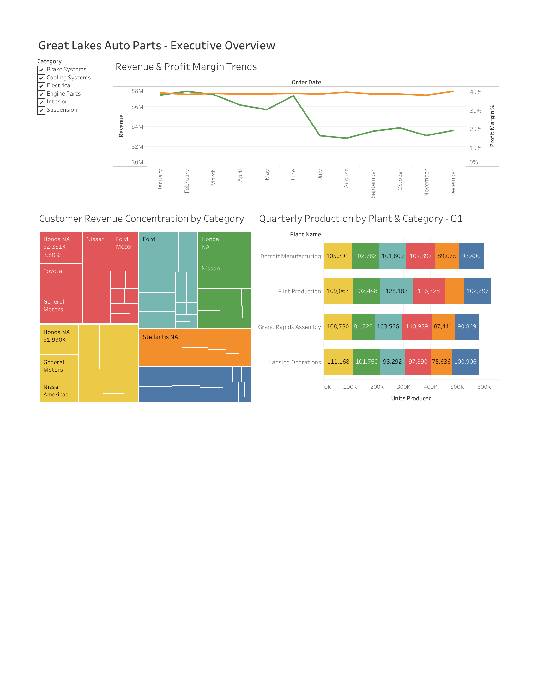

<div align="center">

# Great Lakes Auto Parts — Market Intelligence Dashboard

**A Tableau executive report analyzing revenue trends, plant production, customer concentration, and OEM vs. Aftermarket mix for a fictional automotive parts supplier.**

[](./MKT%20Market%20Intelligence%20Report.pdf)


</div>

---

<p align="center">
  
</p>

<p align="center"><em>Executive overview — revenue trends, plant production, customer concentration, and OEM/Aftermarket mix on a single page.</em></p>

---

## Overview

An end-to-end market intelligence report for **Great Lakes Auto Parts**, a fictional Michigan-based automotive parts supplier. The dashboard answers four core questions an executive team needs to run the business:

- **How is revenue trending month over month, and is profitability holding?**
- **Is our plant network balanced, or are we dependent on one facility?**
- **What share of revenue comes from OEMs vs. Aftermarket, and is that mix stable?**
- **How concentrated is our customer base — who are the accounts we can't afford to lose?**

## Key Insights

| Question | Visualization | Finding |
| --- | --- | --- |
| Revenue & margin trends | Dual-axis line chart | Revenue peaks in early spring (~$7M), drops mid-year, recovers in Q4. **Margin holds steady at 23–31%** — the downturn is volume-driven, not a pricing problem. |
| Plant balance | Grouped bar chart, plant × category | Four plants (Detroit, Flint, Grand Rapids, Lansing) run at similar volumes (~500K–600K units/quarter), with category specialization suggesting equipment or expertise advantages. |
| OEM vs. Aftermarket | Stacked share-of-revenue chart | OEMs dominate consistently — mix stays stable regardless of Top-N filter, indicating structural customer concentration. |
| Customer concentration | Treemap by customer × category | Honda NA, Toyota, Nissan, Ford, and GM make up the top tier. High concentration = elevated customer risk. |

## Tools & Techniques

- **Tableau Desktop** — workbook design, calculated fields, dashboard composition
- **Dual-axis charts** — revenue ($) and profit margin (%) on a single view
- **Parameter controls** — Top N filter lets viewers toggle between top 5 / 10 / 15 / 25 customers
- **Treemap visualization** — customer-by-category revenue concentration
- **Pages control** — quarter-by-quarter progression of plant production
- **Multi-page narrative** — each page builds on the previous insight, ending with a single-page executive overview

## Report Contents

The full PDF walks through the analysis page by page:

1. **Revenue & Profit Margin Trends** (H1 + H2) — seasonal patterns and margin resilience
2. **Quarterly Production by Plant & Category** — operational breakdown across 4 plants
3. **Top N Customers — OEM vs. Aftermarket** — customer-type revenue mix
4. **Customer Revenue Concentration by Category** — treemap highlighting top accounts
5. **Executive Overview** — all four views combined into a single-page summary (shown above)

## Data Model

Built on a sales dataset with the following key fields:

| Field | Description |
| --- | --- |
| `Order Date` | Month/quarter level; drives time-series views |
| `Customer Name` / `Customer Type` | OEM vs. Aftermarket classification |
| `Category` | Brake Systems, Cooling Systems, Electrical, Engine Parts, Interior, Suspension |
| `Plant Name` | Detroit, Flint, Grand Rapids, Lansing |
| `Revenue` | Primary metric |
| `Profit Margin %` | Calculated field |
| `Units Produced` | Plant-level volume |

## How to View

**Fastest — preview image above:** the executive overview page is rendered at the top of this README.

**Full report:** click **📄 Download Full PDF Report** to open the complete 9-page walkthrough with page-level commentary on every visualization.

## Repository Contents

```
tableau-market-intelligence-dashboard/
├── MKT Market Intelligence Report.pdf   Full 9-page Tableau report
├── tableau-dashboard.png                 Executive overview preview image
└── README.md                             This file
```

## About

Built by **Benjamin Padmoasmolo** as part of a marketing analytics portfolio. This project demonstrates advanced Tableau skills: dual-axis and treemap visualizations, parameter-driven filtering, multi-page narrative reporting, and executive-ready dashboard composition.

<div align="center">

---

*Interested in the analysis or looking to discuss marketing analytics roles?*
*Open an issue or reach out via GitHub.*

</div>
